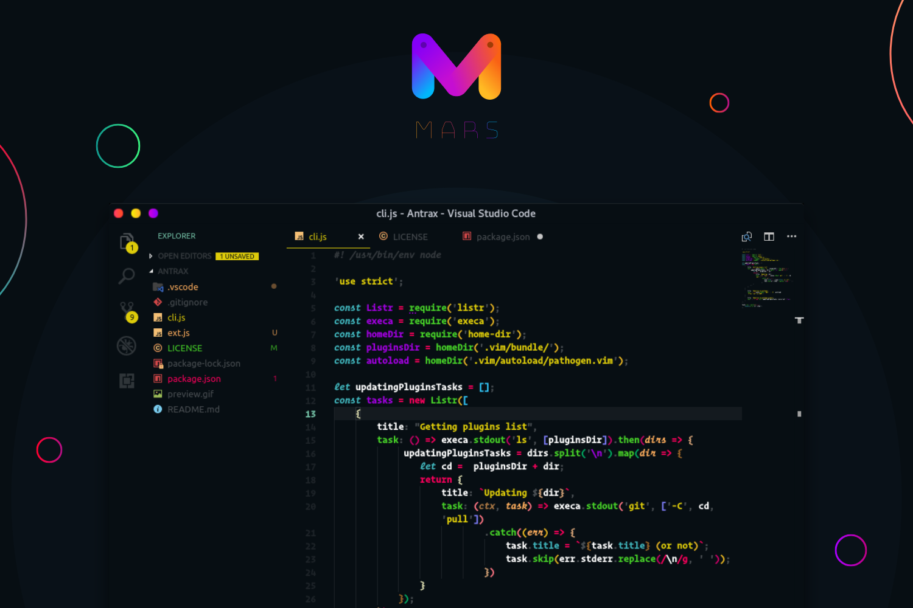

# Moy Theme

An elegant and flavored dark theme for VS Code, customized with subtle borders for better section visibility.

## Installation

1. Open the **Extensions** sidebar in VS Code. `View → Extensions`
2. Search for `Moy Theme`
3. Click **Install** to install it
4. Click **Reload** to reload your editor
5. Navigate to File > Preferences > Color Theme > **Moy Theme**

## License

MIT
